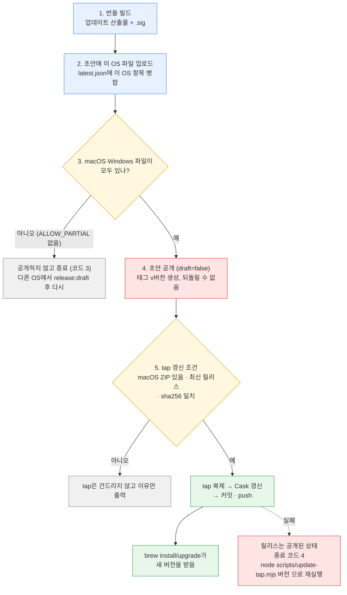

# AGENTS.md

This file provides guidance to coding agents (Codex, Claude Code, and others) when working with code in this repository. `CLAUDE.md` imports it, so keep the shared guidance here.

Twin Deck is a keyboard-driven dual-pane file manager (Tauri 2 + Rust core + React 19 UI, Bun workspaces). UI text, docs, comments, and test names are written in Korean; match that. README.md and `docs/` (00-overview … 11-roadmap, `docs/adr/`) hold the product spec; `docs/05-actions-keybindings.md` is the action/key catalog and should be updated when actions or default keys change.

## Commands

Task runner is go-task (`Taskfile.yml`; `justfile` is an older mirror). Plain commands work too.

```sh
task setup            # bun install + rustup show
task dev              # tauri dev (Vite on :1420 strictPort + Rust)
task test             # cargo test --workspace && bun run test
task check            # fmt --check, clippy --all-targets -D warnings, typecheck
task gen-types        # regenerate TS bindings + default-config.json (see below)
task bundle           # macOS .app / Windows NSIS installer
task install          # bundle + install to /Applications (macOS) / NSIS silent (Windows)
task release:draft    # upload this OS's bundle to a private draft GitHub release (no tag)
task release          # same, then publish — only if both macOS and Windows assets are present; then updates the Homebrew tap (see "릴리스 공개 흐름")
```

Single tests:

```sh
cargo test -p td-ops copy_dir                       # one crate / name filter
cargo test -p twin-deck-desktop preview_cbz         # service tests live in apps/desktop/src-tauri/src/service.rs
cd apps/desktop && bunx vitest run src/__tests__/drag-drop.test.tsx -t "이동"
cd apps/desktop && bunx tsc --noEmit
```

Known baseline noise (not caused by your change): vitest `pdf-preview` fails (jsdom `Blob` has no `.text()`); `service::tests::coalesce_*` is timing-sensitive and can fail in a parallel `cargo test --workspace` but passes alone; `cargo clippy --all-targets` fails on an old `root.clone()` in `service.rs` tests, so use `cargo clippy -p <crate> -- -D warnings` as the real gate.

Release/version: bump `version` in `apps/desktop/src-tauri/tauri.conf.json` **and** `apps/desktop/src-tauri/Cargo.toml` (+ Cargo.lock). `scripts/release.{sh,ps1}` take `draft|publish`; `DRY_RUN=1` skips repo-state checks and only prints mutating `gh` calls. Builds are unsigned (README documents the Gatekeeper workaround).

## 릴리스 "공개" 흐름 (`task release`)

"공개"는 `task release`(내부적으로 `bundle:release` → `scripts/release.sh publish` 또는 `release.ps1 -Mode publish`)를 뜻한다. 먼저 `task release:draft`로 각 OS의 파일을 비공개 초안에 모으고, 두 OS가 모두 올라가 있을 때 공개한다. 공개하면 GitHub 릴리스가 열리고 **Homebrew tap(`gyuha/homebrew-tap`)의 Cask까지 새 버전으로 바뀐다.** 서명 키가 필요하다: `TAURI_SIGNING_PRIVATE_KEY`(키 파일 경로 또는 내용, 비밀번호가 있으면 `TAURI_SIGNING_PRIVATE_KEY_PASSWORD`). 키는 저장소 밖(`~/.tauri/twin-deck.key`)에 두고 읽지 않는다.

진행 순서는 이렇다. 번호는 아래 흐름도와 같다.

1. 번들을 만든다. 이 단계에서만 `--config '{"bundle":{"createUpdaterArtifacts":true}}'`로 업데이트 산출물(`.app.tar.gz`/NSIS 설치 파일과 `.sig`)을 켠다. 평소 `task bundle`은 키 없이 된다.
2. 이 OS의 파일을 초안 릴리스(`v<버전>`)에 올린다. 같은 커밋에서 빌드한 파일만 한 초안에 모인다. 업데이트용 파일과 `latest.json`도 올리고, `latest.json`은 `scripts/update-manifest.mjs`가 이미 올라온 다른 OS 항목을 지우지 않고 이 OS 항목만 합친다.
3. 초안에 macOS용과 Windows용 파일이 모두 있는지 본다. 부족하면 **공개하지 않고** 종료 코드 3으로 끝난다(한쪽만 공개하려면 `ALLOW_PARTIAL=1`). 한쪽 OS 파일이 없는 버전은 `latest.json`에 그 OS 항목이 없어서, 그 OS는 그 버전을 업데이트로 받지 않는다.
4. 초안을 공개한다(`draft=false`). 이때 태그 `v<버전>`이 만들어지고 누구나 받을 수 있게 된다. **되돌릴 수 없다.**
5. `scripts/update-tap.mjs <버전>`이 tap을 갱신한다: 공개 상태이고 이 저장소의 최신 릴리스인지 확인 → 공개 URL에서 macOS ZIP을 내려받아 GitHub가 준 sha256과 대조 → tap 저장소를 새로 받아 `Casks/twin-deck.rb`를 `scripts/update-homebrew-cask.mjs`로 갱신 → 바뀐 게 있으면 커밋하고 push. 그 뒤부터 `brew install --cask gyuha/tap/twin-deck`이 새 버전을 받는다.



운영 메모:

- 5단계가 실패해도 공개는 되돌리지 않는다. 같은 명령을 다시 실행해도 안전하다(이미 반영돼 있으면 아무것도 바꾸지 않는다). tap을 건너뛰는 경우는 macOS ZIP이 없을 때, 이 저장소의 최신 릴리스가 아닐 때(옛 버전이 tap을 되돌리지 않게), sha256이 다를 때(이때는 tap을 바꾸지 않고 오류로 끝낸다)다.
- Windows에서 공개해도 같은 5단계가 돈다(`node`와 `git`, `gh`가 필요하고 tap push 권한이 있어야 한다). 그래서 어느 OS에서 `task release`를 마지막에 실행하든 tap이 갱신된다.
- 시험: `DRY_RUN=1`이면 GitHub를 바꾸는 명령은 출력만 하고, `DRY_RUN=1 node scripts/update-tap.mjs <이미 공개된 버전>`은 push 없이 5단계를 읽기 전용으로 점검한다. 단위 테스트는 `bun test scripts/update-tap.test.mjs`(로컬 bare 저장소를 tap으로 쓰므로 GitHub를 건드리지 않는다).
- **에이전트는 사용자가 명시적으로 요청하기 전에는 `task release`, `release.sh publish`, `node scripts/update-tap.mjs`를 `DRY_RUN` 없이 실행하지 않는다.** 공개된 릴리스와 tap push는 다른 사람이 곧바로 받아 쓰는 것이라 되돌릴 수 없다.

## Architecture

**Rust workspace (`crates/`)** — layered, lower crates don't know upper ones: `td-vfs` (Vfs trait, `LocalFs`, preview reading) → `td-archive` (zip/tar as folders, `CompositeFs` that routes `foo.zip!/inner` paths) → `td-ops` (copy/move/delete with `Control` trait for progress/abort/error collection) → `td-queue` (background job worker, `JobInfo`, events). Also `td-config` (TOML default+user merge, validation, file watch, `set_user_value`), `td-search`, `td-volumes`, `td-watch`, `td-state`, `td-launch`.

**Bridge** — `apps/desktop/src-tauri`: `service.rs` holds `Service<T: Trasher>` (owns ops, queue, watcher, searches, file clipboard) and is what tests exercise; `commands.rs` exposes thin `#[tauri::command] #[specta::specta]` wrappers registered in the command list. tauri-specta generates `packages/ts-client/src/generated/bindings.ts`; `default-config.json` is generated from `default.toml`. A test (`up_to_date`) fails if either is stale → run `task gen-types` after changing any `Type`-derived struct/enum or command signature.

**ts-client** — `Backend` interface (`packages/ts-client/src/backend.ts`) with two implementations: `TauriBackend` (invokes commands) and `FakeBackend` (`fake.ts`, in-memory FS/queue/config used by every vitest). Adding a backend capability means touching: Rust command → regen bindings → `backend.ts` → `tauri.ts` → `fake.ts`.

**UI (`apps/desktop/src`)** — one vanilla zustand store (`state/store.ts`) with a large `api` object; components read via `useApp`/`useAppStore`. Key mechanics:
- Actions/keys: action metadata + default bindings in `packages/actions/src/defaults.ts` (scopes: pane, preview, dialog, find, quickSelect, panel, global …), handlers wired in `apps/desktop/src/actions.ts`, key resolution/dispatch in `ui/useKeyboard.ts` (dialogs get special-cased keys there). `fkey-bindings.test.tsx` enumerates default F-key bindings and must be updated when one is added.
- Dialogs use promise-based `ask()` in the store; copy/move/paste/drop all funnel through `runTransfer` (conflict dialog, queue enqueue, progress dialog via `trackTransfer`).
- Config key checklist: `td-config` struct + `default.toml` → `task gen-types` → `ui/Settings.tsx` `SECTIONS` (keyed by dotted path) → settings tab-list test.
- Drag & drop is **custom pointer-event drag** (`ui/DragLayer.tsx`, `drag` state in the store), not HTML5 DnD: the webview can't report Ctrl during native drags and the OS draws the cursor badge. When the pointer leaves the window it hands off to `start_native_drag` (the `drag` crate) so files can be dropped on Finder/Explorer. `tauri.conf.json` sets `acceptFirstMouse` so an inactive window receives the first press.
- Preview (`ui/Preview.tsx`): text/code/markdown/json/image/pdf/audio/video/cbz. Audio uses data-URL→Blob; video streams through the Tauri asset protocol (`Backend.fileUrl`); PDF paging uses `#page=N` because the WKWebView viewer can't be scrolled from JS.

## Platform gotchas

- macOS filenames are NFD on disk/SMB but the UI uses NFC. `td-vfs/src/local.rs` retries failed stat/create/copy/rename/remove with an NFD path (`retry_nfd`); SMB shares return "not found" for NFC paths, which previously broke copy and conflict detection. Keep that when adding new `LocalFs` operations.
- Windows and Linux code paths exist (`cfg(windows)`) but are only compile-verified from macOS.

## Verifying in the real app

Tests don't cover WKWebView behavior (drag, media, scrolling). To check the real UI, run an isolated instance (`HOME=/tmp/td-iso target/debug/twin-deck-desktop` with a pre-written `state.json`/`config.toml` under `~/Library/Application Support/dev.twindeck.app`; it loads the frontend from the Vite dev server). Send keys/mouse only to that instance's pid — the user's own `tauri dev` app has the same executable name, so never select processes by name.

## Workflow notes

- `.forge/` holds the forge-plugin loop state (plans, done archives, `config.json` with `driveCommit`); `.forge/loop.md` and `drive.md` are gitignored volatile state.
- Commit messages in this repo are Korean and end with the `Co-Authored-By` trailer.
