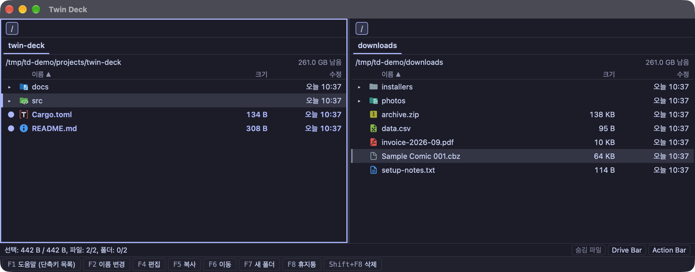
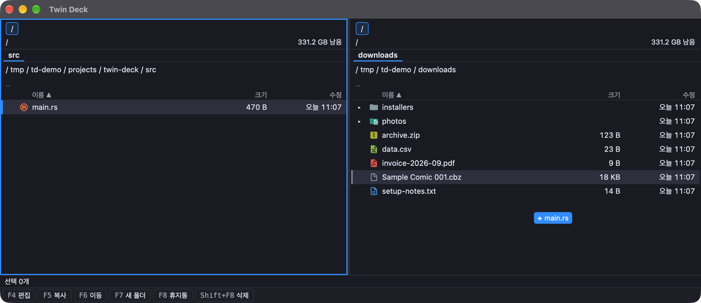
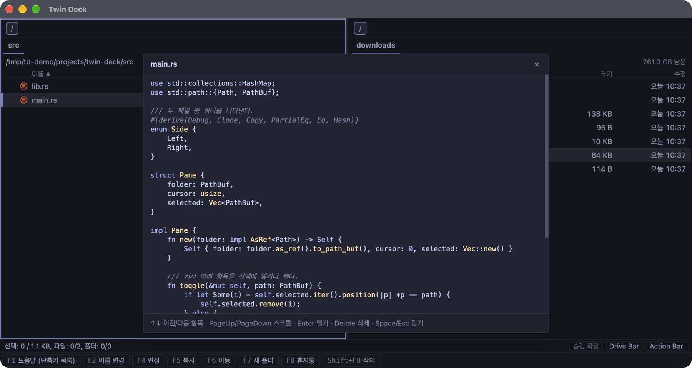
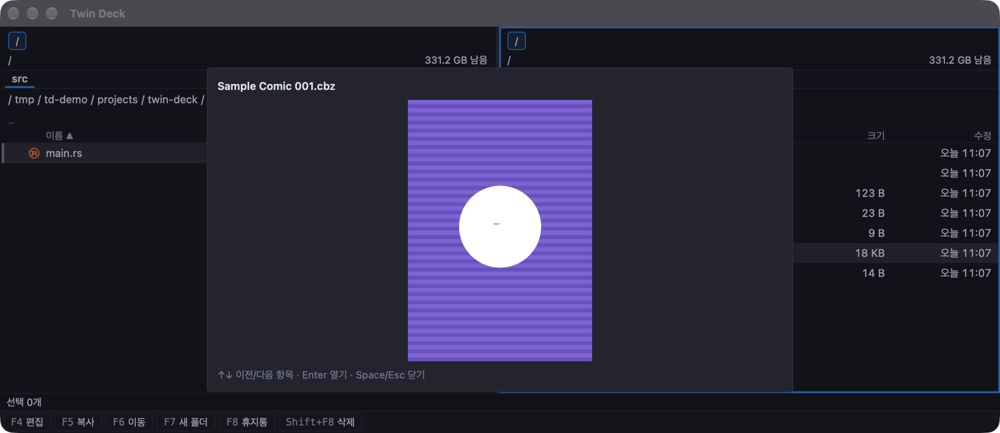
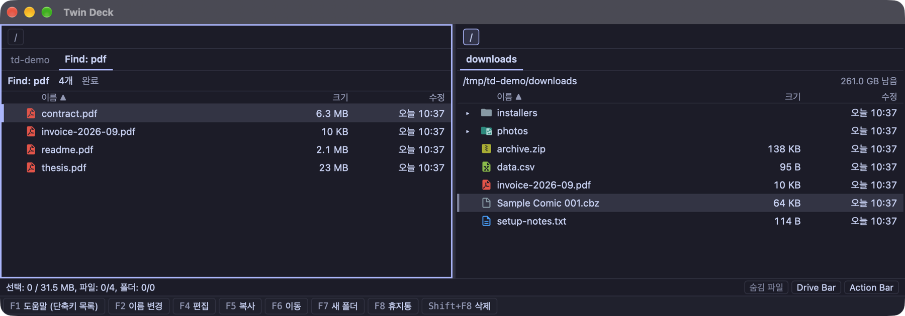
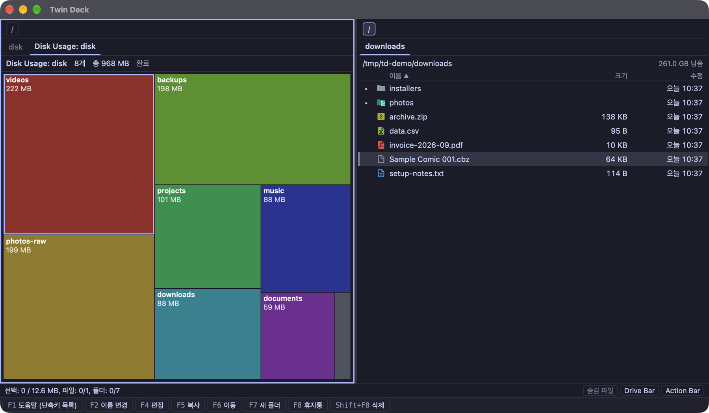
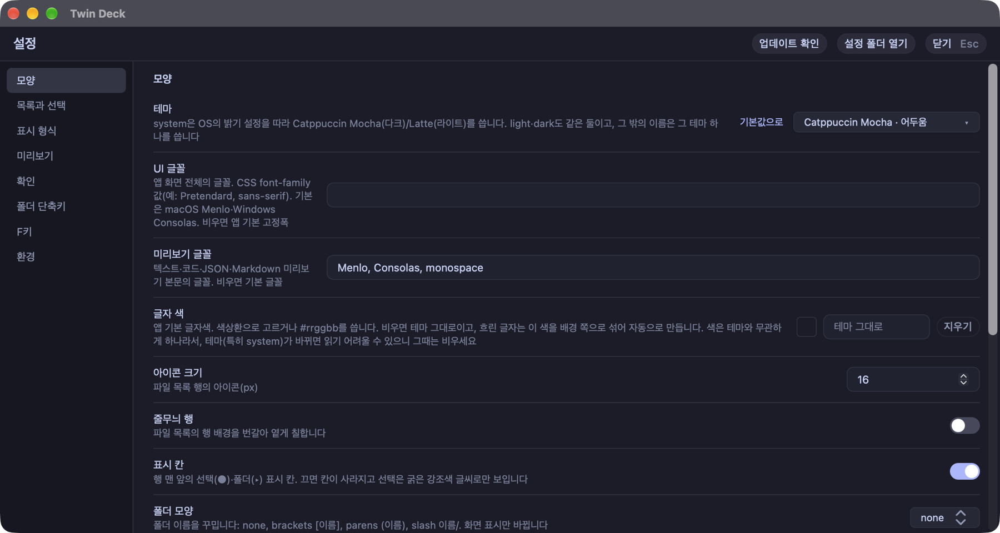
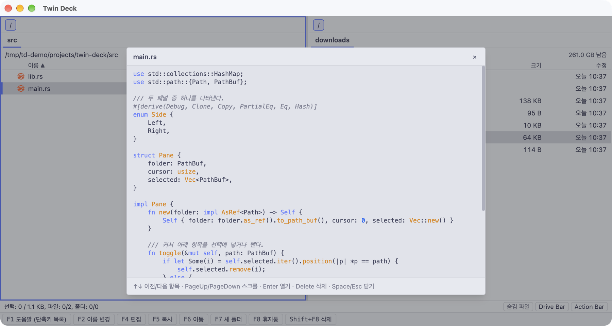
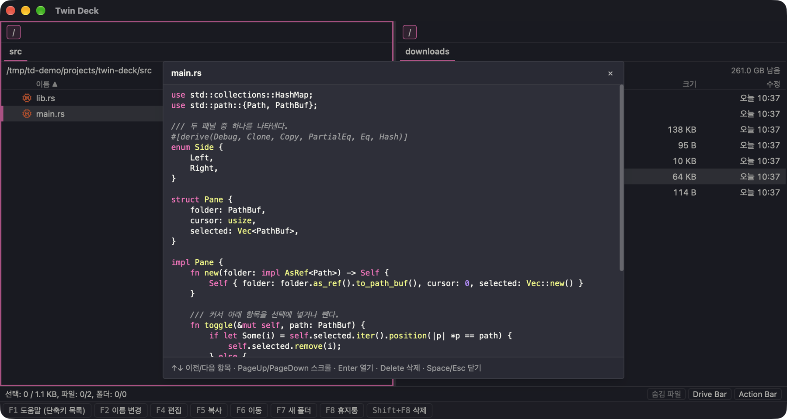

**English** | [한국어](README.md)

# Twin Deck

A file manager that puts two panes side by side so you can move and organize files. You can do almost everything from the keyboard alone, without a mouse.



- Copy from the left folder to the right folder with one `F5`, and move with `F6`.
- Look at a file's contents with the `→` key before opening it. Code, documents, images, PDFs, archives, comics, and videos are supported.
- See folder sizes at a glance as tiles proportional to size, search files by name or content, and move between folders with tabs.
- Change 112 color themes, fonts, and shortcuts, and choose the screen language between Korean and English.

Builds for macOS (Apple Silicon) and Windows (x64) are on the [releases page](https://github.com/gyuha/twin-deck/releases). The app screens, this README's Korean original, `docs/`, and the changelog are in Korean; the app itself can be switched to English in Settings.

## Install

### macOS: Homebrew (recommended)

On an Apple Silicon Mac, install from the [project's own Homebrew tap](https://github.com/gyuha/homebrew-tap).

```sh
brew install --cask gyuha/tap/twin-deck
```

- **The app opens right away.** Twin Deck is not signed or notarized with an Apple developer certificate, so macOS normally blocks it on first launch (Gatekeeper). Installing with Homebrew removes this quarantine mark right after install so it opens without a warning. This bypasses that check, so install only if you trust the source.
- **Apple Silicon only.** Installation is refused on Intel Macs.
- **Update inside the app.** `brew upgrade` skips this app. See "Update" below.

### macOS: manual download

If you don't use Homebrew, install it by hand. Because the app is unsigned, the first launch is blocked with an "unidentified developer" warning. Allow it once as below and it opens like a normal app afterwards.

1. Download `twin-deck-<version>-macos-arm64.zip` from the [releases page](https://github.com/gyuha/twin-deck/releases).
2. Unzip it to get `Twin Deck.app`, and move it to the `/Applications` folder.
3. Remove the quarantine mark in Terminal. This is the most reliable way.

   ```sh
   xattr -dr com.apple.quarantine "/Applications/Twin Deck.app"
   ```

4. Open `Twin Deck.app`.

If you'd rather not use Terminal, do this instead of step 3.

- Open the app once (a warning appears and it does not open).
- Go to **System Settings → Privacy & Security**, press **Open Anyway** next to "Twin Deck was blocked" near the bottom, and confirm with your password or Touch ID.
- On macOS 14 and earlier you can also right-click (Control+click) the app and choose **Open**. This is blocked on macOS 15 and later, so use the System Settings method above or `xattr`.

```
Download zip → unzip → move to /Applications → clear the mark with xattr → launch
                                                    ↓ if you don't use Terminal
                              launch (blocked) → System Settings > Privacy & Security > Open Anyway → launch
```

It is blocked not because anything is wrong with the app but because it has no signature or notarization. Allow it only if you trust the source.

### Windows

Download `twin-deck-<version>-windows-x64-setup.exe` from the [releases page](https://github.com/gyuha/twin-deck/releases) and run it. The installer is unsigned, so Windows may show a warning before running it. Check the source and proceed.

### Other environments

There are no installers for Intel Macs or Linux. You can build it yourself by following "Build from source" below.

### Update

Press **Check for Updates** at the top of the Settings screen (`Mod+,`; on macOS the **Settings…** item in the menu bar, and on every OS the **Settings** button in the status bar at the bottom), or run "update" in the Actions Panel (`Mod+Shift+P`). If there is a new version it shows the changes, installs it, and restarts the app. The app does not check by itself, so press it once in a while.

`Mod` is `Cmd` on macOS and `Ctrl` on Windows.

## Getting started

When you open the app you see two panes. The one with the highlighted border is the pane you are using, and copy and move go from it to the folder in the opposite pane. Learn these keys first.

| What you want to do | Key |
|---|---|
| Switch panes | `Tab` |
| Pick a file up or down | `↑` `↓` |
| Enter a folder / go to the parent folder | `Return` / `Backspace` |
| Select several | `Space` |
| Copy / move to the opposite pane | `F5` / `F6` |
| See contents without opening | `→` |
| Find any feature by name and run it | `Mod+Shift+P` |

Copying goes like this. Put the cursor on the file to copy, or select several with `Space`, then press `F5` and a window asks you to confirm the "destination folder". The default is the folder open in the opposite pane, and pressing `Return` starts the copy. If a file with the same name already exists, it asks what to do.

```
Pick files (↑↓, Space) → F5 → confirm destination (default: the opposite pane's folder) → Return → copy (progress window)
                                                                    ↓ if the same name already exists
                                                    choose overwrite / skip / copy with a new name
```

You can see every shortcut as a list by pressing `F1` (or the **Shortcuts** button in the status bar, or **Keyboard Shortcuts** in the macOS Help menu), and change them in `keybindings.toml` in the settings folder.

## What you can do

### Move and organize files

- **Copy, move, delete**: `F5` copy, `F6` move, `F7` new folder, `Shift+F7` new file, `F8` trash, `Shift+F8` permanent delete.
- **Long jobs**: you see progress in the progress window. `Return` sends it to the background so you can keep working, and `Esc` aborts. If some files fail while copying a folder, the rest keep copying and the failed items are listed.
- **When names collide**: choose overwrite, skip, or copy with a new name. Turn on "apply the same choice to the remaining items" so it does not ask again.
- **Rename**: `F2` renames one. With two or more selected, `F2` (or `Mod+Shift+R`) opens a window to rename them all at once.
- **Archives**: zip-family archives open like folders, and compressing and extracting run in the background like copying.
- **Drag and drop**: drag files to another pane or folder to copy, and hold `Ctrl` while dropping to move. A copy (`+`) or move (`−`) badge appears next to the cursor while dragging.

  

- **Exchange with other apps**: drag files out of the window onto Finder or Explorer to copy (macOS, Windows). `Mod+C`, `Mod+X`, and `Mod+V` are also connected to the operating system's file clipboard, so you can exchange files with Finder or Explorer. Cut files are moved when pasted.

### Preview before opening

Put the cursor on a file and press `→` (or `Mod+Y`) to see its contents right away without opening it. `Esc` or `Space` closes it, and while it is open `↑` `↓` move to the previous or next file.



| Kind | What you see |
|---|---|
| Text, code, Markdown, JSON | Contents (syntax colors for code) |
| Images, PDF | The picture and PDF pages |
| Comic archive (`.cbz`) | The first image inside |
| Other archives | The list of files inside |
| Folder | Sub-items as a tree list |
| Sound, video | A player. Press play to start |
| 3D models (GLB, OBJ, STL, etc.) | A 3D rendering |
| epub | Cover, title, author, table of contents, and chapter text. Switch chapters with `Ctrl+Tab`/`Ctrl+Shift+Tab` or the contents box (files on disk only; DRM-protected files are not supported) |



- On a folder, `Shift+→` previews the folder without entering it.
- Drag the preview window's title bar to move it and its edges to resize it; it remembers position and size.
- To play sound and video as soon as they open, turn it on in the **Preview** tab of Settings.
- **Office documents (docx, xlsx, pptx)**: macOS shows the real document with Quick Look (regardless of settings). On Windows, **only docx** is shown as the real document through the preview handler of the installed Office (the one Explorer's preview pane uses; files downloaded from the internet need "Unblock and view"), while xlsx and pptx use the data preview below. docx also falls back to the data preview when there is no handler (for example Windows without Office), and Linux uses the data preview from the start. The data preview is off by default; turn on "Office document preview" in the **Preview** tab of Settings. It shows only the data inside, not the document, so formatting, layout, and pictures do not appear.

### Find files

`Mod+F` opens the find window. You can search by part of a name, a mask, a regular expression, text inside files, search depth, and names to exclude. Results open in a new tab.



### See folder sizes at a glance

To find folders that take a lot of space, press `Alt+T` on a folder. Subfolders and files are drawn as tiles proportional to size so you can see where the big ones are. Items smaller than 0.5% of the total are grouped into an "N others" tile.



| What you want to do | Key |
|---|---|
| Move between tiles | `←` `→` `↑` `↓` (to the neighbor tile in that direction on screen) |
| Open that folder in the opposite pane | `Return` or click the tile |
| Go down into the folder | `Shift+→`, `Mod+Return`, or double-click |
| Up one level | `Backspace` |
| Switch between list view and tile view | `Alt+T` |
| Exit | `q` |

### Tabs and panes

- **Tabs**: each pane can have several tabs. `Mod+T` opens a new tab and `Mod+W` closes it; a middle click on a tab also closes it.
- **Dragging tabs**: drag a tab to reorder within a pane, or drop it on the opposite pane's tab bar to send it there. If the original pane has only one tab, it is copied instead of moved.
- **Swap panes**: `Mod+U` swaps the tabs, folders, cursors, and selections of the left and right panes.
- **Pane width**: drag the middle border to adjust it.
- **Quick access**: `Alt+2` is the favorites menu and `Alt+3` the recent locations menu; both can be filtered by typing. In the favorites menu, add the current folder with `Ctrl+=`. Assign frequently used folders to `Ctrl+0`~`9` in the **Folder shortcuts** tab of Settings.
- **Drive bar**: pick and eject volumes above the panes. Free space appears at the right end of the path bar.
- **Built-in terminal**: `Alt+Mod+T` opens a terminal in the current folder (rendered by `xterm.js`), replacing the opposite pane. Its font follows the preview font setting (`behavior.preview_font`). `Alt+Mod+O` hides or shows it again (the shell keeps running), and when the shell ends (`exit`, `Ctrl+D`) the pane returns to the file list. It does not open in search results or inside an archive.

### Make it your own

`Mod+,` opens the Settings screen. Hover the **ⓘ** next to an item name to see its description as a tooltip.



- **Language**: choose Korean or English in "Language" in the **Appearance** tab. The screens and the macOS menu bar change immediately; the default is Korean. The documents (README original, `docs/`) and the changelog are in Korean, and this README is the English edition.
- **Color theme**: choose from 112 in "Theme" in the **Appearance** tab. You can search by name or "Dark"/"Light". The default is `system`, which uses Catppuccin Mocha if your computer is in dark mode and Catppuccin Latte otherwise.

  | Light theme (Catppuccin Latte) | Another dark theme (Dracula) |
  |---|---|
  |  |  |

- **Fonts and text color**: set the screen font and preview font separately, and change the app's default text color.
- **List appearance**: choose icon size, zebra rows, folder name decoration, tab style, active pane border highlight, and more.
- **F-keys**: assign a built-in action or an external program to each of `F1`~`F12` (including modifier combinations) and choose whether it shows in the bar at the bottom.
- **Changing keys**: edit shortcuts in `keybindings.toml` in the settings folder.

## Common shortcuts

`Mod` is `Cmd` on macOS and `Ctrl` on Windows. You can see the full list with the `F1` help or `Mod+Shift+P` (Actions Panel).

| Action | Key |
|---|---|
| Switch pane | `Tab` |
| Move | `↑` `↓` `PageUp` `PageDown` `Home` `End` |
| Open / parent folder | `Return` / `Backspace` |
| Toggle selection / select all / clear selection | `Space` or `Insert` / `Mod+A` / `Esc` |
| Preview | `→` or `Mod+Y` |
| Copy / move | `F5` / `F6` |
| New folder / new file | `F7` / `Shift+F7` |
| Rename | `F2` or `Shift+F6` |
| Multi-rename (2 or more selected) | `Mod+Shift+R` |
| Trash / permanent delete | `F8` / `Shift+F8` |
| Clipboard copy / cut / paste | `Mod+C` / `Mod+X` / `Mod+V` |
| Send to the inactive pane | `Alt+→` / `Alt+←` |
| Swap left and right panes | `Mod+U` |
| Duplicate | `Mod+D` |
| File info | `Mod+I` |
| Find files | `Mod+F` |
| Folder sizes (treemap) | `Alt+T` |
| New tab / close tab | `Mod+T` / `Mod+W` |
| Favorites / recent locations | `Alt+2` / `Alt+3` |
| Show hidden files | `Mod+Shift+.` |
| Actions Panel | `Mod+Shift+P` |
| Settings | `Mod+,` |
| Help | `F1` |

## Build from source

You need this for environments without an installer (Intel Mac, Linux) or when you want to modify it yourself.

Requirements:

- [Rust](https://rustup.rs/) (the repository's `rust-toolchain.toml` specifies stable)
- [Bun](https://bun.sh/) 1.3 or later, Node 20 or later (`.nvmrc`)
- [Tauri 2 prerequisites](https://v2.tauri.app/start/prerequisites/) (Xcode Command Line Tools on macOS; WebView2 and C++ build tools on Windows)
- [go-task](https://taskfile.dev/) (optional; without it run the commands in `Taskfile.yml` directly)

```sh
task setup      # install dependencies and check the toolchain
task dev        # run in development mode
task test       # Rust and TS tests
task check      # fmt, clippy, type check
task bundle     # build an installable bundle (.app on macOS, NSIS installer on Windows)
task install    # build the bundle and install on this PC (/Applications on macOS)
```

How to build and publish a release is in [deploy.md](deploy.md) (Korean).

## Config files

Settings and the keymap are human-readable TOML files. You can change most of them in the Settings screen (`Mod+,`) or edit them directly. Saving `config.toml` applies to the running app. The **Open Settings Folder** button at the top of the Settings screen opens this folder.

- macOS: `~/Library/Application Support/dev.twindeck.app/config.toml`
- Keymap: `keybindings.toml` in the same folder

## Learn more (documents are in Korean)

- [Overview](docs/00-overview.md), [Feature spec](docs/01-feature-spec.md)
- [Actions and keybindings](docs/05-actions-keybindings.md), [Settings](docs/06-config-plugins.md), [UI spec](docs/07-ui-spec.md)
- [Changelog](CHANGELOG.md): what changed in each version.
- To contribute, see [dev setup and working rules](docs/10-dev-setup.md) and the [architecture](docs/02-architecture.md).

## License

Proprietary software intended for personal and internal use (`UNLICENSED`). The origins and licenses of external sources are in [THIRD_PARTY_NOTICES.md](THIRD_PARTY_NOTICES.md).
