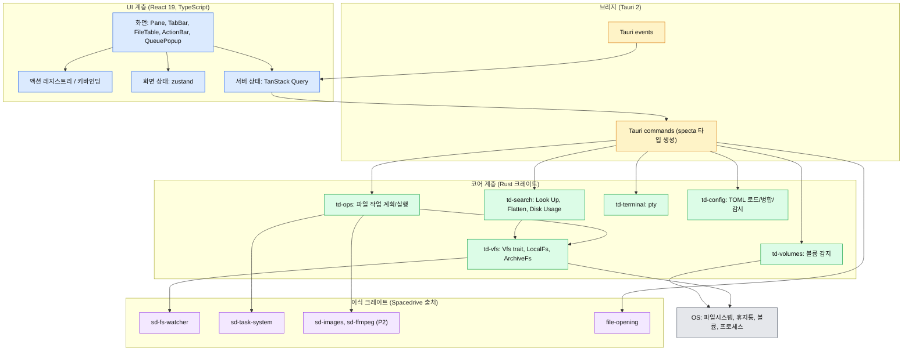
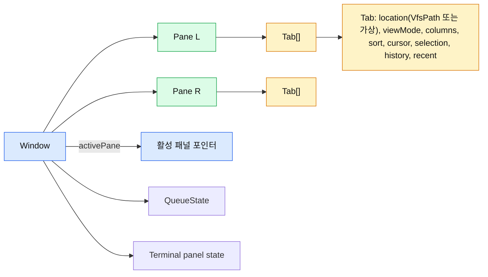
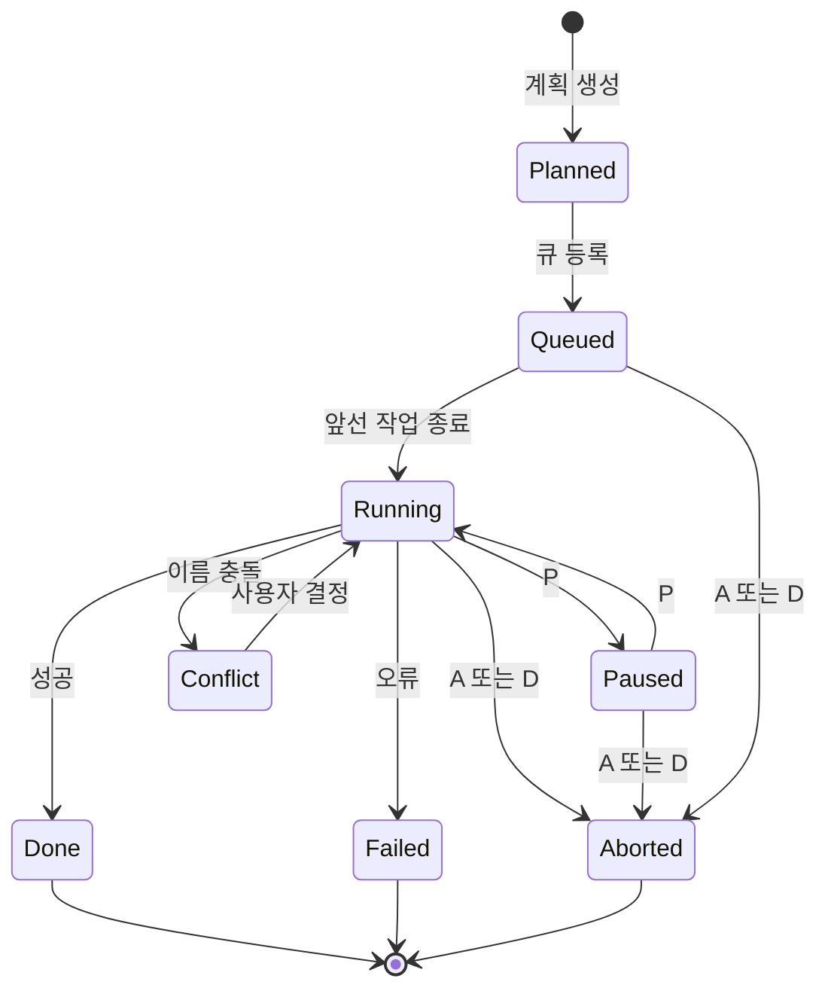

# 02. 아키텍처

## 1. 개요

twin-deck은 하나의 Tauri 프로세스 안에서 Rust 코어와 React UI가 동작한다. Spacedrive처럼 별도 데몬 프로세스를 두고 TCP RPC로 통신하지 않는다([ADR-0003](adr/0003-in-process-ipc.md)). 원격 접속과 모바일이 없으므로 데몬이 줄여 주는 복잡도가 없다.

파일시스템의 진실은 항상 Rust 쪽에 있고, UI는 그 스냅샷을 보여 준다. 패널, 탭, 선택, 커서 같은 화면 상태는 UI가 소유한다. DB를 두지 않고([ADR-0004](adr/0004-no-database.md)) 디렉터리를 조회할 때마다 읽으며, 파일 감시가 변경을 알린다.

계층은 위에서 아래로 의존한다. 아래 계층은 위 계층을 알지 못한다.



## 2. 크레이트와 패키지 경계

각 단위는 한 가지 목적만 갖고, 명시된 인터페이스로만 소통한다. 크레이트 이름의 `td-`는 twin-deck 고유 코드, `sd-`는 Spacedrive에서 이식한 코드(원래 이름 유지)를 뜻한다. 이름을 유지하는 이유는 출처 추적과 상류 변경 비교를 쉽게 하기 위해서다([04](04-spacedrive-reuse.md)).

| 단위 | 역할 | 사용법(공개 인터페이스) | 의존 |
|---|---|---|---|
| `td-vfs` | 로컬/아카이브를 같은 인터페이스로 다룬다 | `Vfs` trait: list, stat, open_read, open_write, create, rename, remove. `VfsPath` | `sd-fs-watcher` |
| `td-ops` | 복사/이동/삭제/이름 변경 등을 계획하고 실행한다 | `plan(op, sources, target)` → `Plan`, `run(plan)` → 작업 핸들과 진행 스트림 | `td-vfs`, `sd-task-system` |
| `td-search` | Look Up, Flatten, Disk Usage | `search(query, scope)` 스트림, `walk_sizes(path)` 스트림 | `td-vfs` |
| `td-volumes` | 마운트된 볼륨 목록과 변경 이벤트 | `list()`, `subscribe()`, `unmount(id)` | OS API |
| `td-terminal` | 패널별 pty 세션 | `open(cwd, shell)`, `write`, `resize`, 출력 스트림 | `portable-pty` |
| `td-config` | 기본값 + 사용자 TOML 병합, 검증, 감시 | `load()` → `Config`, 변경 이벤트 | `toml`, `serde` |
| `td-plugin` (M4) | Lua 플러그인 실행과 샌드박스 | 액션 등록/호출 | `mlua` |
| `apps/desktop/src-tauri` | 위 크레이트를 Tauri command/event로 노출한다 | 생성된 TS 바인딩 | 모든 코어 크레이트 |
| `@twin-deck/ts-client` | 생성된 타입, `invoke` 래퍼, 쿼리 훅 | `useListing`, `useQueue` 등 | Tauri API, TanStack Query |
| `@twin-deck/actions` | 액션 레지스트리, 컨텍스트 조건 평가 | `registerAction`, `runAction`, `resolveKey` | 없음(순수 TS) |
| `@twin-deck/keybinds` | 키 입력 파서와 리스너 (Spacedrive 이식) | `defineKeybind`, 스코프 스택 | 없음 |
| `@twin-deck/ui` | 파일 표, 패널, 다이얼로그 등 화면 컴포넌트 | React 컴포넌트 | `ts-client`, `actions` |

코어 크레이트를 UI와 분리해 두면 나중에 데몬화하거나 CLI를 붙일 때 크레이트를 재사용할 수 있다. 지금 필요한 것은 그 분리까지이며, 데몬 자체는 만들지 않는다.

## 3. 화면 상태 모델

한 창은 정확히 두 패널을 갖고, 패널은 여러 탭을 갖는다. 탭이 위치와 보기 설정을 소유하므로 탭을 바꾸면 선택, 정렬, 이력이 함께 바뀐다.



- **커서와 선택은 별개다.** Marta는 커서 위치와 선택된 항목 집합을 구분하고 Shift+이동으로 범위의 선택을 반전한다(SEL-02). 모델도 `cursor`와 `selection: Set`을 따로 둔다.
- **작업 대상 해석**: 선택이 있으면 선택 항목, 없으면 커서 항목이 대상이다. 이는 Marta의 일반적인 동작이다 `[중간]`. 착수 시 Marta에서 확인한다.
- **가상 탭**은 `location` 대신 `virtual: { kind, payload }`를 갖는다. Disk Usage 결과, Look Up 결과, Flatten 결과가 여기에 해당한다.
- **VfsPath**는 `{ fs: FsId, path: string }`이다. 로컬은 `fs = "local"`이다. 아카이브를 열면 `td-vfs`가 `fs = "archive:<id>"` 마운트를 만들고 부모 `VfsPath`를 기억한다. 아카이브 안의 아카이브는 마운트가 중첩되며, 브레드크럼은 이 부모 사슬로 만든다.

## 4. 목록 조회와 갱신 흐름

큰 디렉터리에서 UI가 멈추지 않도록 목록은 세션 단위로 스트리밍한다. 정렬은 Rust에서 하고, UI는 가상 스크롤로 보이는 구간만 렌더링한다. 이 설계는 가설이며 M2 벤치마크로 검증한다 `[중간]`.

```
탭 이동 요청 → list_open(path, sort) → 세션 ID 반환
                    ↓
       Rust: 읽기 + 정렬 → 청크 이벤트(listing://chunk) 전송
                    ↓
       UI: 청크 수신 → Query 캐시에 병합 → 가상 스크롤 렌더링
                    ↓
       sd-fs-watcher 이벤트 → listing://patch (추가/삭제/변경) → 캐시 갱신
                    ↓ 탭 이동/닫기
       list_close(세션) → 감시 구독 해제
```

- 감시는 열려 있는 탭의 디렉터리에 대해서만 구독하며, 같은 경로는 참조 카운트로 공유한다.
- 이벤트가 몰릴 때는 프레임 단위로 합쳐서 UI에 전달한다. 합치는 간격은 측정 후 정한다.
- 아카이브 안의 목록은 감시 대상이 아니다. 아카이브 파일 자체의 변경만 감시한다.

## 5. 액션 실행 흐름

키 입력, 버튼, 패널, 플러그인이 모두 같은 경로를 지난다([ADR-0007](adr/0007-action-registry.md)).

```
키 입력 → 스코프 스택에서 바인딩 조회 ─┐
Action Bar 버튼 ────────────────────────┤
Actions Panel 선택 ─────────────────────┼→ runAction(id, args, context)
플러그인 호출 ──────────────────────────┘        ↓
                                         isApplicable(context)?
                                          ↓ 아니오        ↓ 예
                                        무시/안내     action.run()
                                                          ↓
                                    UI 상태 변경 또는 Tauri command 호출
                                                          ↓
                                   시간이 걸리는 작업 → 큐에 등록 → 진행 이벤트
```

## 6. 파일 작업과 큐

복사/이동/삭제는 `td-ops`가 계획(Plan)을 만든 뒤 `sd-task-system`에 작업으로 등록한다. 계획 단계에서 충돌, 같은 볼륨 여부, 아카이브 관여 여부를 판정하므로 실행 단계는 판정을 다시 하지 않는다. 상세는 [08-vfs-file-ops.md](08-vfs-file-ops.md).



## 7. 이벤트 카탈로그 (초안)

| 이벤트 | 방향 | 내용 |
|---|---|---|
| `listing://chunk` | Rust → UI | 세션 ID, 항목 배열, 마지막 청크 여부 |
| `listing://patch` | Rust → UI | 세션 ID, 추가/삭제/변경된 항목 |
| `queue://update` | Rust → UI | 작업 ID, 상태, 진행률, 현재 항목 |
| `queue://conflict` | Rust → UI | 작업 ID, 충돌 항목, 선택지 |
| `volumes://changed` | Rust → UI | 볼륨 추가/제거 |
| `config://changed` | Rust → UI | 병합된 설정, 검증 경고 |
| `terminal://data` | Rust → UI | 세션 ID, 출력 바이트 |
| `search://chunk` | Rust → UI | 검색 ID, 결과 항목 |

이벤트 이름과 페이로드는 specta로 TS 타입을 생성하여 UI와 Rust가 어긋나지 않게 한다.

## 8. 오류 처리

- Rust 쪽 오류는 `thiserror` 열거형으로 정의하고 specta로 UI에 노출한다. UI는 오류 종류(권한 거부, 없음, 이미 존재, 볼륨 분리, 디스크 가득 참 등)로 분기해 메시지를 만든다.
- 작업 큐의 개별 항목 실패는 작업 전체를 멈추지 않고 결과 요약에 모은다. 중단 조건은 사용자의 중단 또는 복구 불가능한 오류(디스크 가득 참, 대상 볼륨 분리)다.
- 설정 오류는 앱을 막지 않는다. 잘못된 키는 경고로 표시하고 기본값을 쓴다.

## 9. 성능 원칙

- 목록 렌더링은 `@tanstack/react-virtual` 가상 스크롤을 쓴다(Spacedrive의 ListView와 같은 조합).
- 무거운 작업(정렬, 크기 계산, 검색)은 Rust 워커에서 하고 UI 스레드는 이벤트만 받는다.
- 썸네일은 P2다. 필요한 경우 `sd-images`/`sd-ffmpeg`를 쓰되, DB 없이 디스크 캐시 파일로 관리한다.

## 10. 미확인 과제

| 항목 | 확인 방법 |
|---|---|
| 청크 스트리밍 + Rust 정렬이 10만 항목에서 충분한지 | M2 벤치마크 |
| `sd-task-system`이 일시정지/중단/순차 실행 요구를 그대로 만족하는지 | M1 스캐폴딩 때 API 확인 |
| `sd-fs-watcher`가 `sd-*` 다른 크레이트에 의존하는지 | 이식 전 `Cargo.toml` 확인 ([04](04-spacedrive-reuse.md)) |
| 작업 대상 해석(선택 없을 때 커서 항목) | Marta 실행 확인 |
