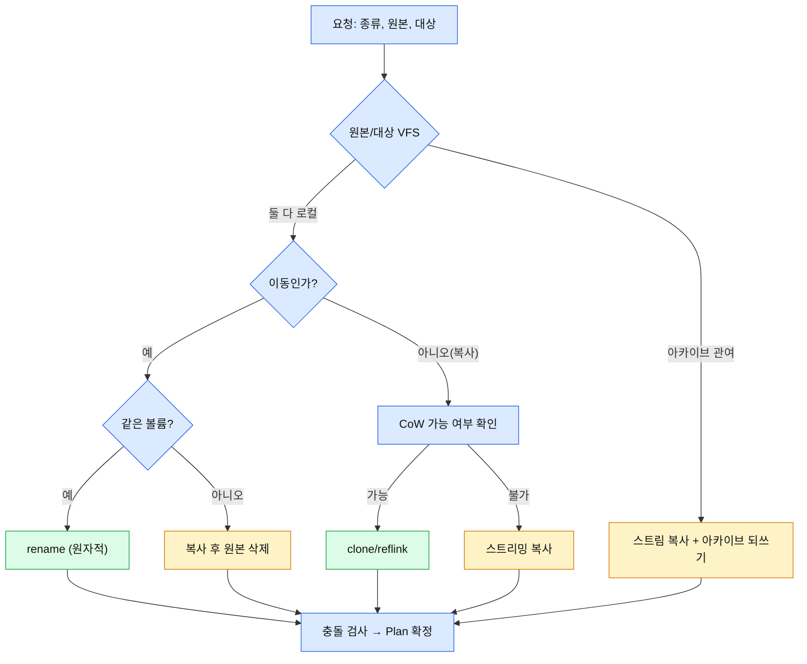

# 08. VFS와 파일 작업

## 1. 개요

파일 작업 계층은 세 부분이다. **VFS**(`td-vfs`)가 로컬과 아카이브를 같은 인터페이스로 다루고, **작업 실행**(`td-ops`)이 복사/이동/삭제를 계획하고 큐에서 실행하며, **탐색 도구**(`td-search`)가 Look Up, Flatten, Disk Usage를 제공한다. 이 구조에서 아카이브 안의 파일도 로컬 파일과 같은 방식으로 선택, 복사, 미리보기 할 수 있다(Marta처럼 아카이브를 폴더로 취급).

## 2. VFS

### 2.1 VfsPath

`VfsPath = { fs: FsId, path: string }`. `path`는 `fs` 안에서의 경로이며 구분자는 `/`로 정규화한다(Windows 로컬은 드라이브 문자를 `fs` 루트 정보로 분리). `fs`가 `"local"`이면 로컬, `"archive:<id>"`이면 열린 아카이브 마운트다.

```
local:/Users/me/a.zip                 → 로컬 파일
archive:7f3:/docs/readme.txt          → a.zip 안의 파일 (마운트 7f3의 부모 = local:/Users/me/a.zip)
archive:9a1:/x.txt                    → 7f3 안의 b.zip 안의 파일 (부모 = archive:7f3:/b.zip)
```

마운트는 `td-vfs`가 관리한다. 부모를 알기 때문에 브레드크럼과 "상위로 이동"이 아카이브 루트에서 자연스럽게 바깥으로 나온다. 아카이브 마운트는 참조 카운트로 관리하며, 이를 여는 탭이 없으면 해제한다.

### 2.2 `Vfs` 인터페이스

구현체마다 지원하는 능력이 다르므로 능력(capability)을 조회할 수 있게 한다.

| 능력 | 로컬 | ZIP 계열 | tar/rar 등 읽기 전용 |
|---|---|---|---|
| `list` | O | O | O |
| `stat` | O | O | O |
| `read` (스트림) | O | O | O |
| `write`/`create`/`remove`/`rename` | O | O (되쓰기, 3절) | X |
| `watch` (변경 감시) | O (`sd-fs-watcher`) | 아카이브 파일 자체만 | 아카이브 파일 자체만 |
| `is_local` | O | X | X |

| 메서드 | 설명 |
|---|---|
| `list(path, sort) → 스트림<Entry>` | 청크 스트림. 정렬 포함 ([02](02-architecture.md#4-목록-조회와-갱신-흐름)) |
| `stat(path) → Entry` | |
| `open_read(path) → 바이트 스트림` | |
| `open_write(path, options) → 바이트 싱크` | 존재하면 덮어쓰기 여부 옵션 |
| `create_dir(path, recursive)`, `create_file(path)` | |
| `rename(from, to)` | 같은 VFS 안에서만 |
| `remove(path, mode)` | `mode`: 휴지통, 영구. 아카이브는 영구만 |
| `capabilities()` | 위 표의 능력 |

`Entry`는 이름, 종류(파일/폴더/링크), 크기, 생성/수정/접근 시간, 권한, 숨김 여부, 링크 대상을 담는다. OS 의존 필드는 optional이다([09](09-platform-support.md)).

### 2.3 아카이브 지원 범위

| 형식 | 읽기 | 쓰기 | 라이브러리 후보 |
|---|---|---|---|
| zip, jar, war, aar, apk, nupkg, klib, sublime-package | O | O | `zip` |
| 사용자 지정 확장자(예: docx) | O | O | 같음 (`file_systems.zip.additional_extensions`) |
| tar, tar.gz, tgz, tar.bz2 | O | X | `tar`, `flate2`, `bzip2` |
| rar | O (제약) | X | 미정 `[알 수 없음]` |
| xar, cab, shar, lzh/lha, cpio, iso, rpm, ar | O | X | 각 형식 라이브러리 지원 여부 조사 후 결정 `[알 수 없음]` |

읽기 전용 형식은 P2 중 tar 계열과 rar를 우선하고 나머지는 수요가 있을 때 추가한다. 암호화 아카이브, 인코딩, 압축 수준은 1차 범위 밖이다(Marta도 문서화하지 않음).

### 2.4 아카이브 편집과 되쓰기 (ARC-03)

ZIP 안의 파일을 편집하면 변경이 아카이브에 반영되어야 한다. 방식:

```
편집 요청 → 항목을 임시 폴더에 추출 → 외부 편집기 실행 → 임시 파일 감시
                                                         ↓ 저장 감지
                          아카이브에 항목 교체 (임시 파일로 새 아카이브 작성 후 원본과 교체)
                                                         ↓ 편집기 종료/탭 닫힘
                                                    임시 파일 정리
```

- 아카이브 전체를 다시 쓰는 방식이라 큰 아카이브에서는 비용이 크다. 진행은 큐 작업으로 표시한다.
- 원본 교체는 임시 파일에 완전히 쓴 뒤 원자적 이름 변경으로 하고, 실패 시 원본을 보존한다.
- 다른 프로세스가 아카이브를 동시에 수정하는 경우는 지원하지 않으며, 수정 시각이 바뀌면 경고한다.
- 중첩 아카이브는 바깥쪽부터 차례로 되쓴다.

## 3. 파일 작업 계획과 실행

### 3.1 계획 단계

작업 요청(종류, 원본 목록, 대상)을 받으면 `td-ops`가 먼저 Plan을 만든다. Plan은 항목별 세부 동작 목록이며, 실행 단계는 판정을 다시 하지 않는다.



- Spacedrive의 복사 전략은 같은 구조로 이동/APFS clone/스트리밍 복사/원격 전송을 라우팅한다 `[높음]`. twin-deck은 이 라우팅 아이디어와 CoW 로직을 참고해 새로 작성한다([04](04-spacedrive-reuse.md)).
- CoW는 macOS APFS(`clonefile`), Linux Btrfs/XFS(`FICLONE`), Windows ReFS(block clone)에서 가능하다. 파일시스템이 지원하지 않으면 스트리밍으로 대체한다. 세부 API는 구현 때 확인한다 `[중간]`.
- 같은 볼륨 판정은 `td-volumes`의 마운트 정보로 한다. 판정 실패 시 안전하게 "복사 후 삭제"를 택한다.

### 3.2 충돌 처리

| 상황 | 기본 동작 |
|---|---|
| 대상에 같은 이름이 있음 | 큐 작업을 일시 멈추고 사용자에게 묻는다: 덮어쓰기 / 건너뛰기 / 이름 바꿔 복사 / 모두에 적용 |
| 폴더와 폴더가 충돌 | 병합(내부 항목별로 재귀 검사). 폴더와 파일이 충돌하면 오류 |
| 원본과 대상이 같은 항목 | 복사는 "이름 바꿔 복사"만 허용, 이동은 무시 |
| 폴더를 자기 하위로 이동/복사 | 계획 단계에서 거부 |

"모두에 적용" 선택은 해당 작업 안에서만 유효하다.

### 3.3 삭제

| 종류 | 동작 |
|---|---|
| 휴지통 | `trash` 크레이트로 OS 휴지통에 이동. 실패하면(휴지통 미지원 볼륨 등) 영구 삭제로 자동 전환하지 않고 사용자에게 알린다 |
| 영구 삭제 | `remove_file`/`remove_dir_all`. 기본으로 확인 대화상자를 띄운다 |
| 아카이브 안 | 영구 삭제만. 아카이브 되쓰기 발생 |

Spacedrive의 삭제 전략에는 보안 삭제 모드도 있으나 `[높음]`, twin-deck 범위에는 넣지 않는다.

### 3.4 새 항목, 이름 변경, 복제

- 새 폴더는 중첩 경로를 지원한다(`a/b/c`). 이미 있는 폴더는 오류 없이 통과하지만 같은 이름의 파일이 있으면 오류다.
- 새 파일은 0바이트 파일이다.
- 이름 변경은 같은 디렉터리 안의 `rename`이다. 대소문자만 바꾸는 경우 대소문자 비구분 파일시스템에서 임시 이름을 거쳐야 한다([09](09-platform-support.md)).
- 복제는 같은 폴더에 접미사를 붙여 복사한다. 접미사 규칙은 자체 정의한다(예: `name copy`, `name copy 2`). Marta의 실제 접미사는 확인하지 못했다 `[알 수 없음]`.

## 4. 작업 큐

| 규칙 | 내용 |
|---|---|
| 실행 방식 | 오래 걸리는 작업은 순차 실행한다. 새 작업은 뒤에 붙는다 (Marta 확인) |
| 제어 | 일시정지(`P`), 중단(`A`/`D`) (Marta 확인) |
| 진행 | 작업별 진행률, 현재 항목, 처리한 바이트/항목 수 |
| 이벤트 | `queue://update`, `queue://conflict` ([02](02-architecture.md#7-이벤트-카탈로그-초안)) |
| 구현 | `sd-task-system` 위에 얹는다. 일시정지, 중단, 순차 실행이 그대로 되는지는 M1에서 확인 `[알 수 없음]` |
| 중단 시 | 진행 중이던 파일은 부분 결과를 남기지 않는다(임시 이름에 쓰고 완료 후 이름 변경). 이미 완료된 항목은 되돌리지 않는다 |
| 빠른 작업 | 항목 수가 적고 작으면 큐를 거치지 않고 즉시 실행할 수 있지만, 같은 경로를 사용한다(같은 코드, 같은 이벤트). 판단 임계값은 M2 실측 후 결정 |

## 5. Look Up

Marta의 Look Up은 Spotlight에 기반한다. 3개 OS에서 공통으로 동작해야 하므로 twin-deck은 **자체 조건 파서 + 백엔드 어댑터** 구조를 쓴다.

```
질의 문자열 → 조건 파서 → 조건 트리 → 백엔드 선택 ─ macOS + Spotlight 사용 설정 → mdfind 변환 (선택)
                                                 └ 기본 → 라이브 순회 검색 (walkdir) → search://chunk
```

### 5.1 질의 문법

| 종류 | 예 | 처리 |
|---|---|---|
| 간단 조건 | `Image`, `Folder`, `Archive` | 종류 필터 (Marta의 목록 그대로: Folder, File, Archive, Disk Image, Text, RTF, HTML, XML, Source Code, Image, Video, Audio, Executable, Application, Bundle, ZIP) |
| 복합 조건 | `Name contains "report"` | `변수 연산자 인수` |
| 이름만 입력 | `report` | 이름 부분 일치 (Marta의 정확한 규칙은 미확인) `[알 수 없음]` |

연산자와 별칭은 Marta와 같다: `=`, `==`, `is`, `equals` / `!=`, `isNot` / `contains`, `has` / `like`, `~=` / `startsWith` / `endsWith`. 의미 차이(예: `like`, `~=`가 와일드카드인지 정규식인지)는 문서에서 확인하지 못했다 `[알 수 없음]`.

### 5.2 변수 지원 범위

| 변수 | 라이브 순회 백엔드 | Spotlight 백엔드 (macOS) |
|---|---|---|
| Name | O | O |
| Content (본문) | O (텍스트 파일만, 크기 제한 필요) | O |
| Size, 수정일, 생성일 | O | O |
| 종류(간단 조건) | 확장자/MIME 기반 | UTI 기반 |
| UTI, Author, Title, Album, Genre 등 메타데이터 | X (미지원 경고) | O |
| Application, Bundle | X | O |

지원하지 않는 변수는 오류 없이 "이 백엔드에서 지원하지 않음" 경고를 표시한다.

### 5.3 범위와 성능

- 전역(`core.lookup.global`)의 범위 기본값은 사용자 홈이다. 전체 파일시스템 검색은 옵션이다. Marta의 전역 범위 정의는 확인하지 못했다 `[알 수 없음]`.
- 현재 폴더(`core.lookup.folder`)는 활성 탭의 위치 하위다. 아카이브 안에서는 그 아카이브 내부만 검색한다.
- 순회는 `td-search`의 별도 워커에서 스트리밍으로 결과를 보내며, 새 질의나 탭 닫기 시 즉시 취소한다.
- `ignore` 크레이트를 쓰는 경우 `.gitignore` 준수 기본 동작을 끈다(파일 관리자에서는 모든 파일이 대상).
- 인덱스는 만들지 않는다([ADR-0004](adr/0004-no-database.md)). 반복 검색이 느리다는 결과가 나오면 M4 이후에 캐시를 검토한다.

## 6. Flatten

현재 폴더 하위의 모든 파일을 재귀 순회해서 하나의 평면 목록(가상 탭)으로 보여 준다. 폴더는 목록에 넣지 않는다(Marta 문서의 세부 규칙은 확인하지 못함 `[알 수 없음]`). 순회는 Look Up과 같은 워커를 쓰며, 결과는 스트리밍으로 도착한다. 링크는 따라가지 않고 링크 자체를 하나의 항목으로 본다(순환 방지).

## 7. Analyze Disk Usage

- 대상 폴더의 하위 항목별 총 크기를 병렬로 계산하여 크기 내림차순으로 가상 탭에 보여 준다. 임의 VFS(아카이브 포함)에서 동작한다(Marta 확인).
- 계산 중에는 부분 결과를 계속 갱신하며, 중단할 수 있다.
- 하드 링크는 한 번만 센다. 링크(심볼릭)는 따라가지 않는다. 볼륨 경계를 넘을지는 옵션(`cross_volumes`)으로 두고 기본은 넘지 않는다. 이 세 규칙은 twin-deck의 결정이며 Marta의 동작은 확인하지 못했다.
- Windows에서 하드 링크 판정은 파일 ID 기반이다(구현 시 API 확인).

## 8. 파일 감시

`sd-fs-watcher`는 notify 8.2를 감싸서 이벤트를 정규화하고 macOS에서 inode 추적으로 이름 변경을 감지한다 `[높음]`. 감시 구독은 열려 있는 탭의 디렉터리에 대해서만 만들고, 같은 경로는 참조 카운트로 공유한다. 이벤트 폭주 시 합쳐서 전달한다. 네트워크 볼륨과 일부 가상 파일시스템은 감시 이벤트가 오지 않을 수 있으므로 수동 새로고침 액션을 제공한다 `[낮음]`.

## 9. 미확인 과제

| 항목 | 확인 방법 |
|---|---|
| Look Up의 이름 입력 규칙, `like`/`~=` 의미, 전역 범위 정의 | Marta 실행 확인 |
| Flatten이 폴더를 포함하는지 | Marta 실행 확인 |
| Disk Usage의 링크/하드 링크/볼륨 경계 처리 | Marta 실행 확인 |
| 복제 접미사 규칙 | Marta 실행 확인 |
| rar와 나머지 읽기 전용 형식의 라이브러리 | 크레이트 조사와 라이선스 확인 |
| `sd-task-system`이 일시정지/중단/순차 실행을 어떻게 지원하는지 | M1에서 API 확인 |
| CoW(clone/reflink) 각 OS API | 구현 시 확인 |
